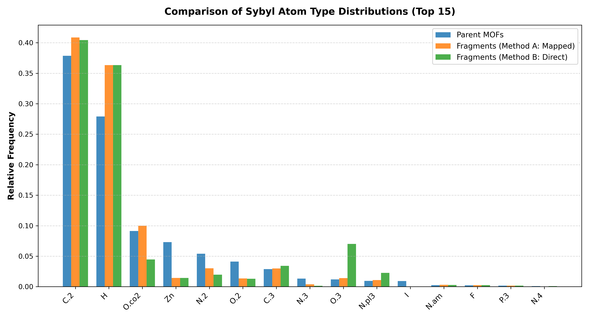

# Atom Types Coverage Analysis

This report analyzes and compares the classical force field-like (Sybyl) atom types present in the parent MOF structures vs the extracted fragments library.

## Executive Summary

| Category | Unique Types | Coverage Status | Coverage % | Description |
| :--- | :---: | :---: | :---: | :--- |
| **Parent MOFs** | 27 | - | 100.0% | Original database of 1,220 single-metal Zn Computationally Ready (CR) structures. |
| **Method A: Mapped** | 24 | 24 / 27 | **88.89%** | Fragment heavy atoms mapped back to parent crystal to inherit parent environment types. |
| **Method B: Direct** | 24 | 24 / 27 | **88.89%** | Fragment typed directly as an isolated molecule via perceived chemistry. |

## Distribution Plot

Below is a comparison of the relative frequency distribution of the top 15 atom types:

## Atom Types Detailed Table

The following table lists every unique Sybyl atom type found in the parent MOFs and its presence/frequency in both Method A (Mapped) and Method B (Direct) fragmentations.

| Sybyl Type | Parent Count | Parent % | Method A Count | Method A % | Method B Count | Method B % | Covered (A) | Covered (B) |
| :--- | :---: | :---: | :---: | :---: | :---: | :---: | :---: | :---: |
| `As` | 12 | 0.004% | 2 | 0.001% | 2 | 0.001% | ✅ Yes | ✅ Yes |
| `B` | 42 | 0.013% | 73 | 0.035% | 73 | 0.035% | ✅ Yes | ✅ Yes |
| `Br` | 152 | 0.045% | 33 | 0.016% | 33 | 0.016% | ✅ Yes | ✅ Yes |
| `C.1` | 202 | 0.060% | 165 | 0.078% | 165 | 0.078% | ✅ Yes | ✅ Yes |
| `C.2` | 126,720 | 37.868% | 86,057 | 40.872% | 85,131 | 40.432% | ✅ Yes | ✅ Yes |
| `C.3` | 9,599 | 2.868% | 6,282 | 2.984% | 7,208 | 3.423% | ✅ Yes | ✅ Yes |
| `Cl` | 156 | 0.047% | 39 | 0.019% | 39 | 0.019% | ✅ Yes | ✅ Yes |
| `F` | 738 | 0.221% | 548 | 0.260% | 548 | 0.260% | ✅ Yes | ✅ Yes |
| `H` | 93,398 | 27.910% | 76,515 | 36.340% | 76,515 | 36.340% | ✅ Yes | ✅ Yes |
| `I` | 3,068 | 0.917% | 17 | 0.008% | 17 | 0.008% | ✅ Yes | ✅ Yes |
| `N.1` | 62 | 0.019% | 21 | 0.010% | 21 | 0.010% | ✅ Yes | ✅ Yes |
| `N.2` | 18,120 | 5.415% | 6,329 | 3.006% | 4,153 | 1.972% | ✅ Yes | ✅ Yes |
| `N.3` | 4,429 | 1.324% | 802 | 0.381% | 319 | 0.152% | ✅ Yes | ✅ Yes |
| `N.4` | 278 | 0.083% | 39 | 0.019% | 218 | 0.104% | ✅ Yes | ✅ Yes |
| `N.am` | 868 | 0.259% | 625 | 0.297% | 596 | 0.283% | ✅ Yes | ✅ Yes |
| `N.pl3` | 3,134 | 0.937% | 2,276 | 1.081% | 4,785 | 2.273% | ✅ Yes | ✅ Yes |
| `O.2` | 13,729 | 4.103% | 2,863 | 1.360% | 2,752 | 1.307% | ✅ Yes | ✅ Yes |
| `O.3` | 3,941 | 1.178% | 2,958 | 1.405% | 14,743 | 7.002% | ✅ Yes | ✅ Yes |
| `O.co2` | 30,542 | 9.127% | 21,059 | 10.002% | 9,385 | 4.457% | ✅ Yes | ✅ Yes |
| `P.3` | 533 | 0.159% | 354 | 0.168% | 354 | 0.168% | ✅ Yes | ✅ Yes |
| `S.2` | 6 | 0.002% | 0 | 0.000% | 0 | 0.000% | ❌ No | ❌ No |
| `S.3` | 266 | 0.079% | 309 | 0.147% | 376 | 0.179% | ✅ Yes | ✅ Yes |
| `S.o` | 8 | 0.002% | 0 | 0.000% | 0 | 0.000% | ❌ No | ❌ No |
| `S.o2` | 111 | 0.033% | 157 | 0.075% | 90 | 0.043% | ✅ Yes | ✅ Yes |
| `Se` | 16 | 0.005% | 0 | 0.000% | 0 | 0.000% | ❌ No | ❌ No |
| `Si` | 62 | 0.019% | 20 | 0.009% | 20 | 0.009% | ✅ Yes | ✅ Yes |
| `Zn` | 24,447 | 7.305% | 3,010 | 1.430% | 3,010 | 1.430% | ✅ Yes | ✅ Yes |

## Missing Atom Types Analysis

The three missing atom types (`S.2`, `S.o`, and `Se`) are extremely low-frequency environments (only 6, 8, and 16 occurrences across the entire parent dataset of 1,220 structures, representing < 0.005% of the total atoms). 

A detailed trace reveals the precise reasons why they are not present in the fragments collection:

1. **`Se` (Selenium)**: Only present in parent structure [BAFVOX.cif](file:///Users/omert/Desktop/UniFrag_main/UniFrag/runUniFrag/zn_cr_cifs_noduplicated/cifs/BAFVOX.cif) (16 atoms). These selenium atoms belong to guest/solvent molecules occupying the framework pores. The UniFrag engine correctly discarded these non-framework guest molecules during extraction, resulting in fragments free of selenium.
2. **`S.o` (Sulfoxide/Sulfone S)**: Only present in parent structure [XINFUW.cif](file:///Users/omert/Desktop/UniFrag_main/UniFrag/runUniFrag/zn_cr_cifs_noduplicated/cifs/XINFUW.cif) (8 atoms). Like selenium, these sulfur atoms belong to non-coordinating guest/solvent species and were correctly excluded.
3. **`S.2` (Sybyl S.2)**: Present in parent structure [BUCXUT.cif](file:///Users/omert/Desktop/UniFrag_main/UniFrag/runUniFrag/zn_cr_cifs_noduplicated/cifs/BUCXUT.cif) alongside `S.3`. During partitioning, the fragmentation engine selected the coordination segment containing `S.3` (which mapped successfully) but trimmed/omitted the framework branches containing `S.2`.

Thus, the absence of these three rare types is a direct consequence of physically and chemically sound extraction choices (such as guest/solvent purification).

## Conclusion

The analysis demonstrates that our fragments library provides **excellent coverage** of the chemical and force field atom types present in the parent MOF structures.
