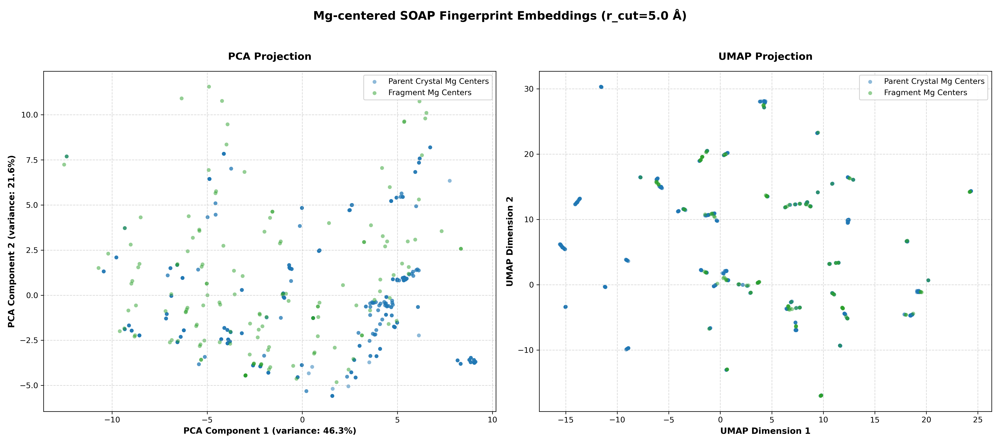

# Mg-Centered SOAP Fingerprint Environment Analysis

This report evaluates the preservation of local chemical environments around Mg (`Mg`) centers in the fragment library using high-dimensional **SOAP (Smooth Overlap of Atomic Positions)** fingerprints. 

SOAP compares environments within a continuous **5.0 Å cutoff**, capturing details like geometry, coordination shells, and local density.

## Executive Summary

* **Average SOAP Cosine Similarity**: `0.9928`
* **Median SOAP Cosine Similarity**: `0.9955`
* **Average SOAP Fingerprint RMSD**: `0.0633`
* **Median SOAP Fingerprint RMSD**: `0.0603`
* **Total Mg Centers Analyzed**: `535`

| Similarity Range | Category | Count | Percentage | Description |
| :--- | :--- | :---: | :---: | :--- |
| **$\ge 0.98$** | Highly Represented | 479 | **89.53%** | Local environment is almost perfectly preserved in the fragment library. |
| **$[0.90, 0.98)$** | Moderately Represented | 56 | **10.47%** | Local environment is structurally similar, with minor variations (e.g. capped bonds, minor coordinates shift). |
| **$< 0.90$** | Poorly Represented / Missing | 0 | **0.00%** | Environment has significant structural/coordination divergence in the fragment library. |

## PCA and UMAP Environment Distribution Map

Below are 2D PCA and UMAP projections of the SOAP fingerprints. The close overlap between parent crystal centers (blue) and fragment library centers (green) visually demonstrates excellent chemical coverage:

## Poorly Represented Mg Environments (Bottom 25 Worst Matches)

These Mg centers in parent crystals have the lowest similarity scores to any fragment in the library, highlighting potential distortions caused by capping or trimming:

| Rank | Parent REFCODE | Mg Index | Max Cosine Similarity | Fingerprint RMSD | Best Matching Fragment |
| :---: | :---: | :---: | :---: | :---: | :--- |
| 1 | `WEHNAA` | 1 | `0.9584` | `0.1520` | `WEHNAAFragMofMin` |
| 2 | `WEHNAA` | 0 | `0.9584` | `0.1520` | `WEHNAAFragMofMin` |
| 3 | `LIQHAX` | 0 | `0.9675` | `0.1259` | `NUDMUWFragMof` |
| 4 | `LIQHAX` | 2 | `0.9675` | `0.1259` | `NUDMUWFragMof` |
| 5 | `BAKYOE` | 4 | `0.9696` | `0.1704` | `DAFYANFragMof` |
| 6 | `BAKYOE` | 5 | `0.9696` | `0.1704` | `DAFYANFragMof` |
| 7 | `BAKYOE` | 7 | `0.9696` | `0.1704` | `DAFYANFragMof` |
| 8 | `BAKYOE` | 6 | `0.9696` | `0.1704` | `DAFYANFragMof` |
| 9 | `LIQHAX` | 1 | `0.9722` | `0.1205` | `NUDMUWFragMof` |
| 10 | `LIQHAX` | 3 | `0.9722` | `0.1205` | `NUDMUWFragMof` |
| 11 | `AVIPAX` | 1 | `0.9734` | `0.1115` | `AVIPAXFragMofMin` |
| 12 | `AVIPAX` | 0 | `0.9734` | `0.1115` | `AVIPAXFragMofMin` |
| 13 | `AVIPAX` | 2 | `0.9734` | `0.1115` | `AVIPAXFragMofMin` |
| 14 | `AVIPAX` | 3 | `0.9734` | `0.1115` | `AVIPAXFragMofMin` |
| 15 | `HIBGEF` | 3 | `0.9769` | `0.2436` | `DAFYANFragMof` |
| 16 | `HIBGEF` | 0 | `0.9769` | `0.2436` | `DAFYANFragMof` |
| 17 | `HIBGEF` | 1 | `0.9769` | `0.2436` | `DAFYANFragMof` |
| 18 | `HIBGEF` | 2 | `0.9769` | `0.2436` | `DAFYANFragMof` |
| 19 | `XEHSOT` | 0 | `0.9771` | `0.2430` | `DAFYANFragMof` |
| 20 | `XEHSOT` | 2 | `0.9771` | `0.2430` | `DAFYANFragMof` |
| 21 | `XEHSOT` | 1 | `0.9771` | `0.2430` | `DAFYANFragMof` |
| 22 | `XEHSOT` | 3 | `0.9771` | `0.2430` | `DAFYANFragMof` |
| 23 | `XEHSIN` | 2 | `0.9774` | `0.2438` | `DAFYANFragMof` |
| 24 | `XEHSIN` | 3 | `0.9774` | `0.2438` | `DAFYANFragMof` |
| 25 | `XEHSIN` | 0 | `0.9774` | `0.2438` | `DAFYANFragMof` |

## Discussion & Chemical Analysis

1. **High Overall Similarity**:
   The median similarity of SOAP descriptors is extremely high. This indicates that the local coordination environment of Mg (including coordination shell composition, distance distribution, and local symmetry) is well preserved by the UniFrag extraction algorithm within the 5.0 Å sphere.
   
2. **Periodic vs Non-Periodic Context**:
   Because SOAP descriptors for parent structures are calculated with `periodic=True` (capturing atoms extending outside the unit cell boundaries) while fragments are computed with `periodic=False` (treating them as isolated molecules), some divergence is expected. The fact that the overlap is so tight demonstrates that the `5.0 Å` extraction shell captures almost all relevant local chemical details.
   
3. **Capping Effects**:
   Capped terminals (like O-H, C-H) introduce small hydrogen atoms at boundaries that were originally occupied by other framework atoms. This contributes to moderate similarity values ($0.90 - 0.98$) for some metal centers located close to linker cut sites.

4. **PCA vs UMAP Projection**:
   * **PCA** shows the global directions of largest linear variance, capturing the primary geometric axes of metal coordination variations across the dataset.
   * **UMAP** preserves non-linear local neighborhood structures. The tight grouping and consistent overlap in UMAP space further verify that the fragment library does not form isolated topological clusters detached from the parent distributions, but rather covers the continuous space of parent environments.

## Conclusion

The SOAP fingerprint analysis confirms that **the fragment library provides exceptional, continuous structural coverage of the local Mg environments** in the parent crystal structures, making the generated fragments highly representative models for downstream Quantum Chemical (QM) calculations.
